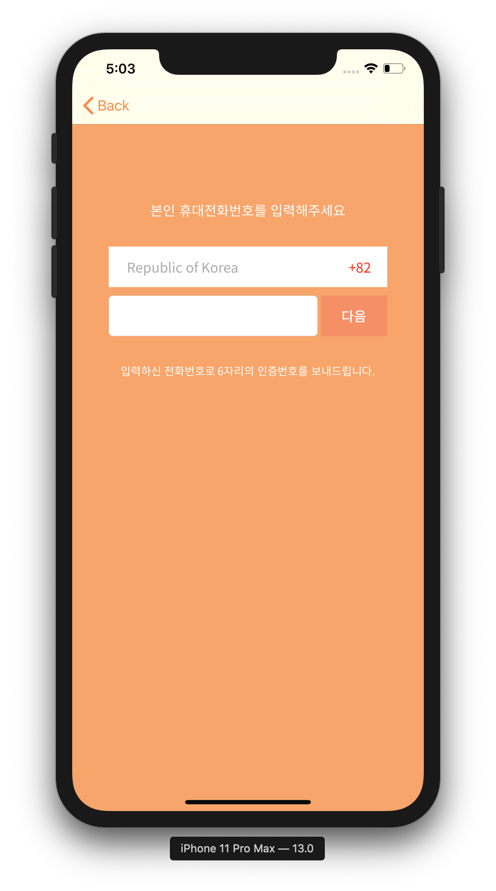
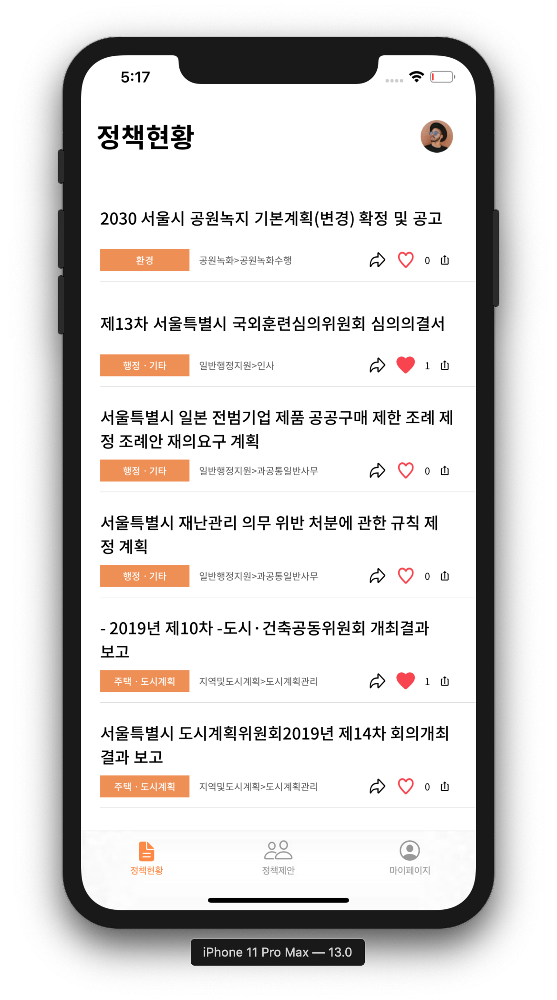
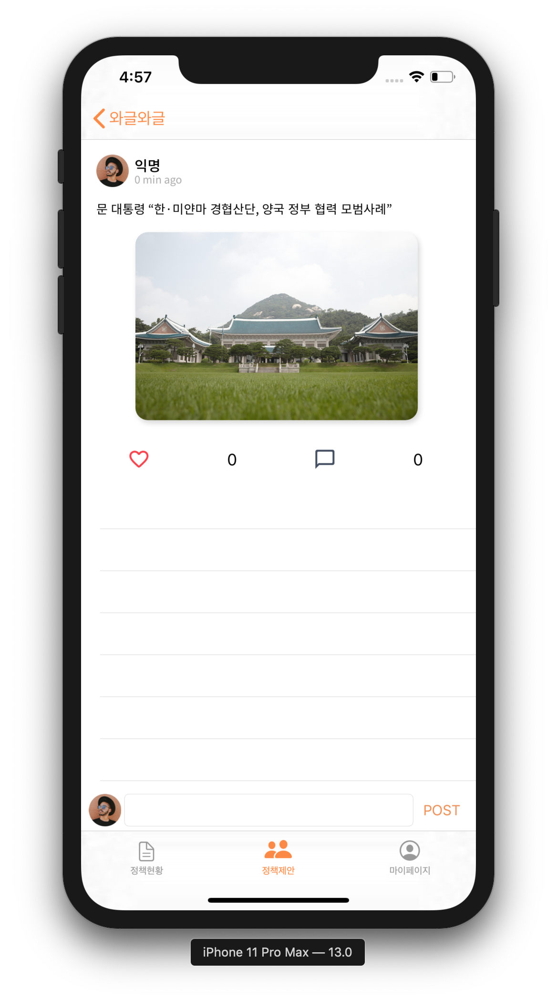
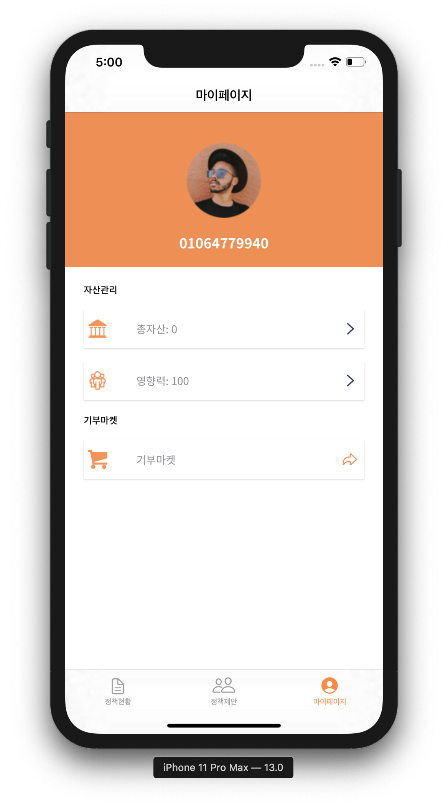

# :kr: WageulSeoul (와글와글)

> **The People’s Online Petition & Discussion Platform**

 

## :open_book: Introduction

**Wagle Seoul is a platform designed to encourage citizens to actively participate in local politics.**

This Service will encourage active community and political participation by providing rewards to those who actively participate in local politics.

### :iphone: App Features

#### :page_facing_up: Policy Status(정책현황)

The Policy Status panel provides information about the policies of the region in which the user resides and allows the user to evaluate them.

#### :loudspeaker: Policy Proposals(정책제안)

This panel allows citizens to propose policies to develop their residential areas.

#### :bust_in_silhouette: User Info(유저정보)

From this panel, users can see their own voting power, and the amount of reward points for their participation.

#### :shopping: ​Reward Market(보상 마켓)

In the Reward Market, user can sponsor public service campaigns using rewards or they can exchange rewards to local currency.

 

## :desktop_computer: ​Build and Runtime Requirements

- Xcode 6.0 or later
- iOS 8.0 or later
- OS X v10.10 or later
- iCloud–enabled provisioning profile

## :copyright: ​License

This project is licensed under the MIT License - see the [LICENSE.md](./LICENSE.md) file for details

## :man_technologist: ​Authors

* **Seung Hun Han** - iOS Developer - [GITHUB](https://github.com/shhan730)

  

* **Choi Ji Heon** - Designer - [GITHUB](https://github.com/smakerdev)

  

* **Hee Won Kang** - Backend Developer - [GITHUB](https://github.com/kang-heewon)

## :email: ​Contact

###**Seung Hun Han**(한승훈) - dev.shhan@gmail.com

#### Suwon, Republic of Korea

If you have any questions feel free to contact us!

